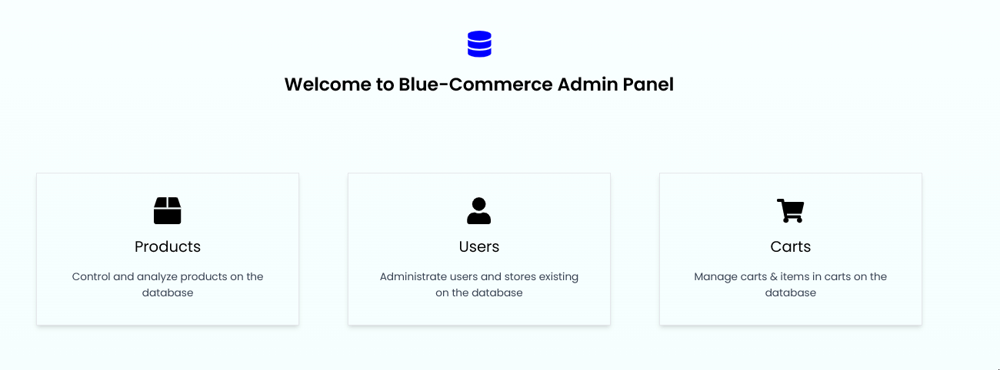
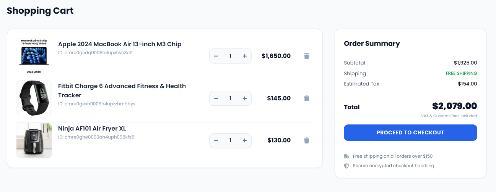

<div align="center">

# 🛒 BluE-Commerce

### A full-stack e-commerce platform built with architectural intent and industry-standard tech stack.



<h3><a href="https://blue-commerce-frknecn3.vercel.app" target="_blank">CLICK HERE FOR LIVE DEMO</a></h3>
<br><br>
[](https://nextjs.org)
[](https://www.typescriptlang.org)
[](https://www.postgresql.org)
[](https://stripe.com)


</div>

---

## The Architectural Decision That Matters

This project underwent a deliberate, complete backend migration from **Firebase (NoSQL)** to **PostgreSQL + Prisma (SQL)**. This has been the result of my evolution as a developer, realizing the downsides of NoSQL compared to SQL, especially in an e-commerce setting. This project is especially important for me because of this.

### Why the migration happened

Firebase's Firestore is a document store. It's excellent for rapid prototyping and flat data with simple read/write patterns. But an e-commerce platform is fundamentally *relational*: an `Order` belongs to a `User`, contains many `Products`, and each `Product` belongs to a `Category`. Trying to enforce this in a document store leads to data duplication, denormalized structures, and fragile application-layer integrity checks.

Migrating to PostgreSQL with Prisma solved this at the schema level:

- **Referential integrity** is enforced by the database, not by hope.
- **JOIN queries** via Prisma replace multiple round-trip Firestore reads.
- **Transactions** ensure that a payment event and its corresponding order record are always consistent.
- **Type-safe queries** via Prisma Client eliminate an entire category of runtime errors.

---

## ⚙️ Tech Stack

| Layer | Technology |
|---|---|
| **Framework** | Next.js 14 (App Router) |
| **Language** | TypeScript 6 |
| **Database** | PostgreSQL + Prisma ORM v7 |
| **Auth** | NextAuth.js v4 |
| **Payments** | Stripe (server-side sessions + webhooks) |
| **State Management** | Redux Toolkit |
| **Styling** | Tailwind CSS |
| **Search** | Fuse.js |
| **Image Hosting** | Cloudinary |
| **Animation** | Framer Motion |
| **Deployment** | Vercel |

---

## 🏗️ Core Features — Ranked by Complexity

### 1. 💳 Stripe Integration — Server-Side Checkout & Webhook Fulfillment

This is the most architecturally sensitive feature in the project. Payment flows cannot afford to be handled on the client.

The checkout flow is powered by **Stripe Checkout Sessions**, which are created exclusively on the server via a Next.js **Server Action** or **Route Handler**. The client never touches the Stripe secret key — it receives only a session URL to redirect to.

The other half of the equation is the **webhook endpoint**. After a successful payment, Stripe sends a `checkout.session.completed` event to `/api/webhooks/stripe`. This endpoint:

1. Verifies the payload signature using `stripe.webhooks.constructEvent` to reject spoofed requests.
2. Extracts the session metadata (user ID, cart items).
3. Creates a persisted `Order` record in PostgreSQL via Prisma — inside a transaction.
4. Clears the cart state.

This pattern ensures that order records are created by a verified server-to-server event, not by a client-side `fetch` that could be replayed or manipulated.

```
User → Checkout → Server creates Stripe Session → Stripe Checkout Page
                                                         ↓ (payment success)
                                              Stripe POST /api/webhooks/stripe
                                                         ↓
                                              Prisma creates Order in PostgreSQL
```

---

### 2. 📦 Order Management System — Relational History via Prisma

The Orders page isn't a simple list of IDs fetched from a flat collection. It retrieves structured, relational data using Prisma's `include` and `select` to efficiently join across the `User`, `Order`, and `Product` tables in a single query. This means there are no N+1 problems.

This page is rendered as a **React Server Component (RSC)**, meaning the database query runs at request time on the server, and zero data-fetching JavaScript is shipped to the client. The user gets a fully rendered, SEO-friendly page with their historical order data.

```ts
// Conceptual query shape fetching relational data in one round-trip
const orders = await prisma.order.findMany({
  where: { userId: session.user.id },
  include: {
    items: {
      include: { product: true },
    },
  },
  orderBy: { createdAt: 'desc' },
});
```

---

### 3. 🗃️ Relational PostgreSQL Schema — Built for E-Commerce Integrity

The Prisma schema models the domain correctly from the start:

- **`User`** — authenticated via NextAuth, hashed passwords via `bcryptjs`.
- **`Product`** — belongs to a `Category`, has image URLs via Cloudinary.
- **`Category`** — normalized; products reference categories by foreign key, not by string embedding.
- **`Order`** — has many `OrderItems`; each `OrderItem` references a `Product` by ID with a quantity and price snapshot at time of purchase.

Price snapshots on `OrderItem` are a critical detail: they preserve what the customer actually paid, independent of future product price changes. This is standard practice in production commerce systems and demonstrates awareness of real-world data mutation risks.

---

### 4. 🛒 Global State — Redux Toolkit for Cart & UI Synchronization

The shopping cart is managed client-side with **Redux Toolkit**, which keeps state normalized and mutations predictable via `createSlice`. Cart state is shared across the entire application without prop drilling — product cards, the navbar badge, and the checkout summary all read from the same Redux store.

This approach was chosen deliberately over React Context for the cart: Redux's DevTools integration makes debugging state mutations significantly easier, and RTK's `createAsyncThunk` provides a clean pattern for any async operations (e.g., syncing cart to server for logged-in users).

---

### 5. 🔎 Role-based Mechanisms & Error Handling

The project features a dashboard for admins to create/publish/archive/delete/edit products, users or carts. Access to this feature is based on the `User`'s `role` field. Since this isn't foolproof enough, each and every Server Action has an `adminAction` check to make sure the application is safe & sound.

---

## 🚀 Next.js 14 — App Router, RSC & Server Actions

This project is built entirely on the **App Router** paradigm introduced in Next.js 13/14. This means:

- **React Server Components (RSC) by default.** Data fetching happens on the server. Pages like the product catalog, product detail, and orders history ship zero client-side data-fetching JS.
- **Server Actions** replace traditional REST endpoints for mutations (form submissions, cart updates, checkout initiation). They are co-located with the components that trigger them. I used Server Actions for every Admin Dashboard event, considering that Admins will most probably use the web app. 
- **Streaming and Suspense** are available at the layout level, enabling progressive page hydration.

The result is a smaller JavaScript bundle, faster Time-to-Interactive, and a better Lighthouse score compared to a traditional SPA or Pages Router approach.

---

## 🎨 UI / UX — Design System with Tailwind & Custom Elements

The UI layer features Tailwind CSS for industry-standard prototyping as well as my very own Custom Components such as `SelectWithSearch` or `SearchInput` that allow for a better looking website as well as higher development speed.

**Framer Motion** is used for micro-interactions and page transitions, adding polish without sacrificing the seamless nature of the project.

---

## 🗂️ Project Structure

```
blue-commerce/
├── prisma/
│   ├── schema.prisma        # Relational data model
│   └── seed.ts              # Development seed data (Faker.js)
├── src/
│   ├── app/                 # Next.js App Router pages & layouts
│   │   ├── (auth)/          # Auth routes (sign-in, sign-up)
│   │   ├── api/
│   │   │   └── webhooks/
│   │   │       └── stripe/  # Stripe webhook handler
│   │   ├── orders/          # Order history (RSC + Prisma)
│   │   └── ...
│   ├── components/          # Shared UI components (Shadcn-based)
│   ├── lib/
│   │   ├── prisma.ts        # Prisma client singleton
│   │   └── stripe.ts        # Stripe client initialization
│   └── store/               # Redux Toolkit slices
└── package.json
```

---

## 🛠️ Local Development

**Prerequisites:** Node.js 18+, PostgreSQL instance (local or cloud)

```bash
# 1. Clone the repo
git clone https://github.com/frknecn3/blue-commerce.git
cd blue-commerce

# 2. Install dependencies
npm install

# 3. Configure environment variables
cp .env.example .env.local
# Fill in: DATABASE_URL, NEXTAUTH_SECRET, STRIPE_SECRET_KEY,
#          STRIPE_WEBHOOK_SECRET, CLOUDINARY_*, NEXTAUTH_URL

# 4. Run database migrations
npx prisma migrate dev

# 5. Seed the database
npm run seed

# 6. Start the dev server
npm run dev
```

**Stripe Webhook (local):**
```bash
stripe listen --forward-to localhost:3000/api/webhooks/stripe
```

---

## 🌐 Environment Variables

| Variable | Description |
|---|---|
| `DATABASE_URL` | PostgreSQL connection string |
| `NEXTAUTH_SECRET` | Secret for NextAuth session signing |
| `NEXTAUTH_URL` | Base URL of the application |
| `STRIPE_SECRET_KEY` | Stripe server-side secret key |
| `STRIPE_WEBHOOK_SECRET` | Stripe webhook signing secret |
| `NEXT_PUBLIC_STRIPE_PUBLISHABLE_KEY` | Stripe client-side publishable key |
| `CLOUDINARY_CLOUD_NAME` | Cloudinary cloud name |
| `CLOUDINARY_API_KEY` | Cloudinary API key |
| `CLOUDINARY_API_SECRET` | Cloudinary API secret |

---

<div align="center">

Built with deliberate architectural choices — not just assembled parts.

**[View Live Demo →](https://blue-commerce-frknecn3.vercel.app)**

</div>
